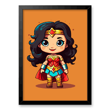

# 👋 Olá, Comunidade Dev! 👩‍💻

  

## 🌟 Sou Dieniffer, mas prefiram me chamar de *Jay* 🌟
> 🏷️ **Back-End Developer**
> 

---

### 🛠 Minha Jornada 🚀

Estou em uma fascinante jornada no universo do desenvolvimento de software. Iniciei minha transição de carreira com um curso técnico e agora estou totalmente envolvida em um programa intensivo. A cada passo que dou, minha paixão por essa área só aumenta!

### 🌱 Sobre Este Perfil 🌱

Este perfil é um reflexo do meu desenvolvimento profissional. Aqui você encontrará uma gama de projetos que demonstram minha evolução e que espero que sirvam como inspiração ou recursos para o seu aprendizado.

> 📚 **Nota:** Em breve, cada tecnologia listada abaixo terá um projeto de estudo correspondente neste GitHub como apresentação.

---

## 🌐 Vamos Conectar? 🌐

---

## 🛠 Tecnologias e Habilidades 🛠

---

